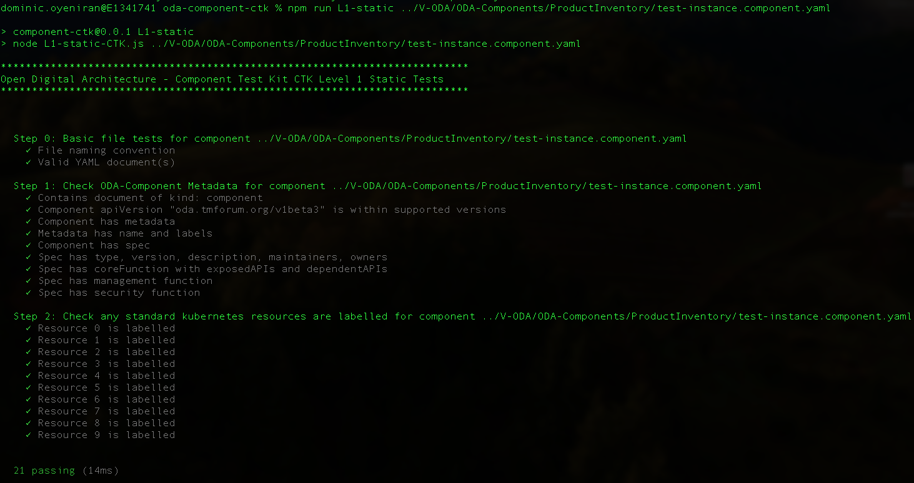

## Tutorial to build ODA-Component from Open-API Reference Implemenation

This tutorial shows the complete process to package, test and deploy an ODA-Component, using the nodejs reference implementation of the TMF637 Product Inventory Management API as the source code. You should be able to follow the process below using an existing software application as source (the process should work for simple applications - it is intended as a tutorial to get you started; For more complex applications you may have to decompose to multiple containers/micro-services and even multiple ODA-Components).

There is a video of this tutorial at: [ODA Component Tutorial Video walkthrough](https://youtu.be/wZJ8d5uQ7_8)

For an introdution to the Open-Digital Architecture component model, take a look at the recording from the Digital Transformation World Series conference:


[DTW World Series Masterclass](https://www.youtube.com/watch?v=e_m-nnKvWIs)


### Step 1. Download Reference Implementation

We are using one of the Reference implementations of the Open-APIs as a starting point. Go to the open-API Table at [https://projects.tmforum.org/wiki/display/API/Open+API+Table](https://projects.tmforum.org/wiki/display/API/Open+API+Table) and download one of the reference implmentation `.zip` files (we are using the Product Inventory Management API, but you can choose any).


The reference implementation provides a Nodejs API server implementation that requires a MongoDb backend. It provides a nice swagger-ui on top of a Open-API implementation stub. The reference implementation is set-up to run in IBM Cloud (bluemix). To enable it to run locally or in a docker container, we edit the /api/swagger.yaml file to remove the `host:` field (it will default to looking in the current host), and change the `schemes:` from `https` to `http`.


### Step 2. (optionally) test locally with local MongoDb.

In the `utils/mongoUtils.js` file, you will need to replace the connectHelper with a helper function that uses local connection string:

```js
/* connection helper for running MongoDb from url */
function connectHelper(callback) {

  var credentials_uri = "mongodb://localhost:27017/tmf";
  let options = {
    useNewUrlParser: true 
  };
  MongoClient.connect(credentials_uri, options, function (err, db) {
    if (err) {
      mongodb = null;
      callback(err,null);
    } else {
      mongodb = db.db("tmf");
      callback(null,mongodb);
    }
  });
}
```

You can then test the API by using `npm install` and `npm start`. You should be able to view the API in a browser by browsing to [http://localhost:8080/docs](http://localhost:8080/docs).


### Step 3. Configure for use within Kubernetes.

When we depoy this nodejs code for use within Kubernetes, it will connect to MongoDb using a url which is provided by a Kubernetes service. We also use environment variable to allow Kubernetes to, for example, determine the path where the API is exposed.


#### 3.1 Configure mongoDb connection url to use within Kubernetes

In the `utils/mongoUtils.js` file, you will need to update the local connection string to a url that wil work within Kubernetes (this will match the kubernetes service name for mongoDb). Note we include a release name passed as an environment variable (as we could potentially deploy multiple instances of a component in the same canvas).

```js
/* connection helper for running MongoDb from url */
function connectHelper(callback) {
  var releaseName = process.env.RELEASE_NAME; // Release name from Helm deployment
  var credentials_uri = "mongodb://" + releaseName + "-mongodb:27017/tmf";
  let options = {
    useNewUrlParser: true 
  };
  MongoClient.connect(credentials_uri, options, function (err, db) {
    if (err) {
      mongodb = null;
      callback(err,null);
    } else {
      mongodb = db.db("tmf");
      callback(null,mongodb);
    }
  });
}
```
#### 3.2 Use environment variables to allow API path to be configured externally

By default the nodejs code will serve the API at the path in the swagger file, which for our example is `/tmf-api/tmf-api/productInventory/v4/`. We want to potentially deploy multiple component instances in the same environment, and so we add a configurable `COMPONENT_NAME` to the start of the URL. We need to do this in the `swaggerDoc` as well as in the `swagger-ui-dist/index.html` that provides the swagger user interface. 

Edit the `./index.js` file in the implementation root directory.
```js
const swaggerDoc = swaggerUtils.getSwaggerDoc();

// Get Component instance name from Environment variable and put it at start of API path
var componentName = process.env.COMPONENT_NAME;
if (!componentName) {
  componentName = 'productinventory'
}
console.log('ComponentName:'+componentName);
// end

// add component name to url in swagger_ui - i.e. swagger-ui-dist/index.html
fs.readFile(path.join(__dirname, './node_modules/swagger-ui-dist/index.html'), 'utf8', function (err,data) {
  if (err) {
    return console.log(err);
  }
  var result = data.replace(/api-docs/g, swaggerDoc.basePath + 'api-docs' );
  console.log('updating ' + path.join(__dirname, './node_modules/swagger-ui-dist/index.html'));
  fs.writeFile(path.join(__dirname, './node_modules/swagger-ui-dist/index.html'), result, 'utf8', function (err) {
      if (err) return console.log(err);
  });
});

// add component name to swaggerDoc
swaggerDoc.basePath = '/' + componentName + swaggerDoc.basePath

//end
```

#### 3.3 Add home resource at root of the API, and also move where the docs and api-docs are hosted

By default, the swagger tools expose a resource at all the paths in the API (defined in the swagger.yaml file); They don't offer any response at the root of the API. This can make it harder for a developer to discover the API paths. In addition, a Kubernetes ingress will by default test the root of the API (as a liveness test). If it receives no response, it will assume the microservice is dead and will not route any traffic to it. A simple solution is to create a home resource that provides a set of links to the other API endpoints. The TM Forum Open-API design standards (TMF630) provides a good definition of this resource which is called the `home` or `entrypoint` resource.

First, we've created a simple module in `utils/entrypoint.js` to build this entrypoint resource at run-time from the swagger.yaml. Operating at run-time also provides the ability to send a contextual response (that might vary depending on the role of the user, for example).

Next, we integrated this module by adding `app.use(swaggerDoc.basePath, entrypointUtils.entrypoint);` as the last hook before starting the server.

Finally, we change the path where the 'api-docs' and 'docs' are exposed. By default they are served at `/api-docs` and `/docs`. Again, we want to avoid conflicts if we have multiple components running in the same environment. We solve this by moving them to the full path of the API, so in our example, they would be at `/tmf-api/tmf-api/productInventory/v4/`

```js
  // Serve the Swagger documents and Swagger UI
  app.use(middleware.swaggerUi({   apiDocs: swaggerDoc.basePath + 'api-docs',
    swaggerUi: swaggerDoc.basePath + 'docs',
    swaggerUiDir: path.join(__dirname, 'node_modules', 'swagger-ui-dist') }));

  // create an entrypoint
  const entrypointUtils = require('./utils/entrypoint');
  console.log('app.use entrypoint');
  app.use(swaggerDoc.basePath, entrypointUtils.entrypoint);

    // Start the server
  http.createServer(app).listen(serverPort, function () {
    console.log('Your server is listening on port %d (http://localhost:%d)', serverPort, serverPort);
    console.log('Swagger-ui is available on http://localhost:'+ serverPort  + swaggerDoc.basePath + 'docs', serverPort);
  });
```


### Step 4. Package the nodejs implementation into a docker image

Create a dockerfile in the product inventory inplementation directory with the instructions to build our image. We are starting with the official [node](https://hub.docker.com/_/node) docker image.

```text
FROM node:12
```

Define the working directory of a Docker container 

```text
WORKDIR /usr/app
```

This image comes with Node.js and NPM already installed so the next thing we need to do is to install the app dependencies.

```text
COPY package*.json ./
RUN npm install
```

Then we copy the source code.

```text
COPY . .
```

The app binds to port 8080 so we'll use the EXPOSE instruction to have it mapped by the docker daemon:

```text
EXPOSE 8080
```

Finally we define the command that will run the app.

```text
CMD ["node", "index.js"]
```


The complete dockerfile should look like:

```text
FROM node:12
WORKDIR /usr/app
COPY package*.json ./
RUN npm install
COPY . .
EXPOSE 8080
CMD ["node", "index.js"]
```

Before we build this dockerfile, we create a `.dockerignore` file (so the at node_modules packages are not copied into the docker image - this would make the image very large. The `RUN npm install` command inside the dockerfile will install these on demand).

```
node_modules
npm-debug.log
```

To build the docker image, we use the command:

```
docker build . -t dominico/productinventoryapi:0.1 -t dominico/productinventoryapi:latest
```

Note: we use the -t to tag the image. We give the image two tags, one with a version number and the other with a `latest` tag that will overwrite any previously uploaded images.

To check that the images are in the local repository, we use this command:

```
% docker images

--Result--
REPOSITORY                     TAG       IMAGE ID       CREATED             SIZE
dominico/productinventoryapi   0.1       6f2819946f76   About an hour ago   910MB
dominico/productinventoryapi   latest    6f2819946f76   About an hour ago   910MB

```
Finally we upload the docker image to a Docker repository. I'm using the default [DockerHub](https://hub.docker.com) with an account `dominico` that I have created previously. If this is the first time accessing the docker repository you will need to login first with the `docker login` command.

```sh
docker push  dominico/productinventoryapi --all-tags
```

### Step 5. Create PartyRole Implementation

Product Inventory component requires a Party Role Microservice that implements the TMF669 Party Role Management API (based on the NodeJs reference implementation). Party Role provides security supporting function and canvas service to the Product Inventory Component. 

Follow the previous steps 1-4 to create the Party Role implementation.  

### Step 6. Create PartyRole Initialisation Implementation

Next we create a party role initialisation service which  initialises party roles in the mongo db database.

### Step 7. Create Component Envelope 

The Component Envelope contains the meta-data required to automatically deploy and manage the component in an ODA-Canvas environment. The envelope will contain meta-data about the standard Kubernetes resources, as well as the TM Forum ODA extensions. There is a detailed breakdown of the Component Envelope in [ODAComponentDesignGuidelines](https://github.com/tmforum-oda/oda-ca-docs/blob/master/ODAComponentDesignGuidelines.md).


We will use [Helm](https://helm.sh/) to create the component envelope as a Helm-Chart. This tutorial assumes you have already installed Helm on your local environment.

The first step is to use `helm create <chartname>' which creates a boiler-plate chart:

```sh
helm create productinventory
```

The boiler-plate should be visible under the productinventory folder. It contains a `Chart.yaml` (with meta-data about the chart) and a `values.yaml` (where we put any default parameters that we want to use). It also contains a `charts/` folder (empty) and a `templates/` folder (contining some boiler-plate Kubernetes templates).

The `Chart.yaml` will look something like the code below - no changes are required.

```yaml
apiVersion: v2
name: productinventory
description: A Helm chart for Kubernetes

# A chart can be either an 'application' or a 'library' chart.
#
# Application charts are a collection of templates that can be packaged into versioned archives
# to be deployed.
#
# Library charts provide useful utilities or functions for the chart developer. They're included as
# a dependency of application charts to inject those utilities and functions into the rendering
# pipeline. Library charts do not define any templates and therefore cannot be deployed.
type: application

# This is the chart version. This version number should be incremented each time you make changes
# to the chart and its templates, including the app version.
# Versions are expected to follow Semantic Versioning (https://semver.org/)
version: 0.1.0

# This is the version number of the application being deployed. This version number should be
# incremented each time you make changes to the application. Versions are not expected to
# follow Semantic Versioning. They should reflect the version the application is using.
# It is recommended to use it with quotes.
appVersion: "1.16.0"
```


The `values.yaml` file contains some sample parameters that are used in the template samples. Where you see a parameter in curly brackets in the templates file (e.g. `{{ .Values.replicaCount }}`) - this will insert the value `replicaCount` from the values file into the template.

The `Charts/` folder lets you include existing Helm charts into your new chart - for example, we could include one of the standard MongoDb Helm charts (which would support a high-availability multi-node MongoDb deployment, for example). For simplicity during this tutorial we will leave `Charts/` empty.

Finally, most of the details we will create are in the `templates/` folder. Take a look inside this folder and you will see multiple sample templates:

```
deployment.yaml  
hpa.yaml  
ingress.yaml 
service.yaml 
serviceaccount.yaml  
```

For our Product Inventory component, we will create three deployments (one for the nodejs container that implements the core Product Inventory API, one for dependent PartyRole API, and one for the mongoDb).

Delete the `deployment.yaml` template and create three new templates called `deployment-productinventoryapi.yaml`, `deployment-partyroleapi.yaml` and the last one `deployment-mongodb.yaml`.

Copy the code below into  `deployment-productinventoryapi.yaml`. Only the `component.type` field has been parameterised (a production heml chart would typically parameterize many more values, which are stated in the `values.yaml` file). The file also uses the `Release.Name` which is the name given to the instance of the component when deployed by Helm (we could potentially deploy multiple instances in the same ODA-Canvas). Note that we also pass the release name and component name as environment variables into the container.

```yaml
apiVersion: apps/v1
kind: Deployment
metadata:
  name: {{.Release.Name}}-productinventoryapi
  labels:
    oda.tmforum.org/componentName: {{.Release.Name}}-{{.Values.component.type}}
spec:
  replicas: 1
  selector:
    matchLabels:
      app: {{.Release.Name}}-productinventoryapi
  template:
    metadata:
      labels:
        app: {{.Release.Name}}-productinventoryapi
    spec:
      containers:
      - name: {{.Release.Name}}-productinventoryapi
        env:
        - name: RELEASE_NAME
          value: {{.Release.Name}}           
        - name: COMPONENT_NAME
          value: {{.Release.Name}}-{{.Values.component.type}}           
        image: dominico/productinventoryapi:latest
        ports:
        - name: {{.Release.Name}}-prodinvapi
          containerPort: 8080
```

Next, we need create the deployment resource for the party Role API. Copy the code below into `deployment-partyroleapi.yaml`


```yaml
apiVersion: apps/v1
kind: Deployment
metadata:
  name: {{.Release.Name}}-partyroleapi
  labels:
    oda.tmforum.org/componentName: {{.Release.Name}}-{{.Values.component.type}}
spec:
  replicas: 1
  selector:
    matchLabels:
      impl: {{.Release.Name}}-partyroleapi
  template:
    metadata:
      labels:
        app: {{.Release.Name}}-{{.Values.component.type}}
        impl: {{.Release.Name}}-partyroleapi
        version: dominico-partyroleapi-latest
    spec:
      containers:
      - name: {{.Release.Name}}-partyroleapi
        image: lesterthomas/partyroleapi:latest
        env:
        - name: RELEASE_NAME
          value: {{.Release.Name}}           
        - name: COMPONENT_NAME
          value: {{.Release.Name}}-{{.Values.component.type}}           
        imagePullPolicy: Always
        ports:
        - name: {{.Release.Name}}-prapi
          containerPort: 8080
        startupProbe:
          httpGet:
            path: /{{.Release.Name}}-{{.Values.component.type}}/tmf-api/partyRoleManagement/v4/partyRole 
            port: 8080
          initialDelaySeconds: 10
          periodSeconds: 5          
          failureThreshold: 30
```

We also need to deploy a mongoDb. We will use the standard mongoDb image from dockerhub. Copy the code below into: `deployment-partyroleapi.yaml`


```yaml
apiVersion: apps/v1
kind: Deployment
metadata:
  name: {{.Release.Name}}-mongodb
  labels:
    oda.tmforum.org/componentName: {{.Release.Name}}-{{.Values.component.type}}
    app: {{.Release.Name}}-mongodb
spec:
  replicas: 1
  selector:
    matchLabels:
      app: {{.Release.Name}}-mongodb
  template:
    metadata:
      labels:
        app: {{.Release.Name}}-mongodb
    spec:
      containers:
      - name: {{.Release.Name}}-mongodb
        image: mongo:latest
        ports:
        - name: {{.Release.Name}}-mongodb
          containerPort: 27017
        volumeMounts:
        - name: {{.Release.Name}}-mongodb-pv-storage
          mountPath: "/data/db"
      volumes:
      - name: {{.Release.Name}}-mongodb-pv-storage
        persistentVolumeClaim:
          claimName: {{.Release.Name}}-mongodb-pv-claim
```

The mongoDb requires a persistentVolume and so we create a persistentVolumeClaim template `persistentVolumeClaim-mongodb.yaml`. 


```yaml
apiVersion: v1
kind: PersistentVolumeClaim
metadata:
  name: {{.Release.Name}}-mongodb-pv-claim
  labels:
    oda.tmforum.org/componentName: {{.Release.Name}}-{{.Values.component.type}}
spec:
  accessModes:
  - ReadWriteOnce
  resources:
    requests:
      storage: 5Gi
```


We need to make the mongoDb available to the nodejs productinventoryapi image, so we create a Kubernetes Service resource in `service-mongodb.yaml`. Note the service matches the connection url we created in step 3.


```yaml
apiVersion: v1
kind: Service
metadata:
  name: {{.Release.Name}}-mongodb
  labels:
    oda.tmforum.org/componentName: {{.Release.Name}}-{{.Values.component.type}}
    app: {{.Release.Name}}-mongodb
spec:
  ports:
  - port: 27017
    targetPort: {{.Release.Name}}-mongodb
    name: {{.Release.Name}}-mongodb
  type: NodePort
  selector:
    app: {{.Release.Name}}-mongodb
```

We need to expose the product inventory API using a Service as well in `service-productinventoryapi.yaml`.

```yaml
apiVersion: v1
kind: Service
metadata:
  name: {{.Release.Name}}-productinventoryapi
  labels:
    app: {{.Release.Name}}-productinventoryapi
    oda.tmforum.org/componentName: {{.Release.Name}}-{{.Values.component.type}}
spec:
  ports:
  - port: 8080
    targetPort: 8080
    name: {{.Release.Name}}-productinventoryapi
  type: NodePort
  selector:
    app: {{.Release.Name}}-productinventoryapi
```

The party role API needs to be exposed using a service in `service-partyroleapi.yaml`.

```yaml
apiVersion: v1
kind: Service
metadata:
  name: {{.Release.Name}}-partyroleapi
  labels:
    app: {{.Release.Name}}-partyroleapi
    oda.tmforum.org/componentName: {{.Release.Name}}-{{.Values.component.type}}
spec:
  ports:
  - port: 8080
    targetPort: {{.Release.Name}}-prapi
    name: http-{{.Release.Name}}-partyroleapi
  type: NodePort
  selector:
    impl: {{.Release.Name}}-partyroleapi
```

Lastly, we create a kubernetes job resource in order to initialise a role using the party role API in `cronjob-roleinitialization.yaml`

```yaml
apiVersion: batch/v1
kind: Job
metadata:
  name: {{.Release.Name}}-roleinitialization
  labels:
    oda.tmforum.org/componentName: {{.Release.Name}}-{{.Values.component.type}}
spec:
  template:
    metadata:
      labels:
        app: {{.Release.Name}}-roleinitialization
    spec:
      containers:
      - name: {{.Release.Name}}-roleinitialization
        image: dominico/roleinitialization:latest
        env:
        - name: RELEASE_NAME
          value: {{.Release.Name}}           
        - name: COMPONENT_NAME
          value: {{.Release.Name}}-{{.Values.component.type}}           
        imagePullPolicy: Always
      restartPolicy: OnFailure
  backoffLimit: 10
```

We have created all the Kubernetes resources to deploy the mongoDb, party role and product inventory nodejs containers and expose them as services. The final step is to add the ODA-Component meta-data. This meta-data will be used at run-time to configure the canvas services. Create the code below in `component-productcinventory.yaml`.

This is a relatively simple component that just exposes one API as part of its `coreFunction`. Note that we have included the release name and component name in the root of the API path (this is a good pattern to follow so that the API doesn't conflict with any other components deployed in the same environment).

```yaml
apiVersion: oda.tmforum.org/v1alpha4
kind: component
metadata:
  name: {{.Release.Name}}-{{.Values.component.type}}
  labels:
    oda.tmforum.org/componentName: {{.Release.Name}}-{{.Values.component.type}}
spec:
  type: {{.Values.component.type}}
  selector:
    matchLabels:
     oda.tmforum.org/componentName: {{.Release.Name}}-{{.Values.component.type}}
  componentKinds:
    - group: core
      kind: Service    
    - group: core
      kind: PersistentVolumeClaim
    - group: apps
      kind: Deployment  
  version: "0.0.1"
  description: "Simple Product Inventory ODA-Component from Open-API reference implementation." 
  maintainers:
    - name: Dominic Oyeniran
      email: dominic.oyeniran@vodafone.com
  owners:
    - name: Dominic Oyeniran
      email: dominic.oyeniran@vodafone.com     
  coreFunction:
    exposedAPIs: 
    - name: productinventorymanagement
      specification: https://raw.githubusercontent.com/tmforum-apis/TMF637_ProductInventory/master/TMF637-ProductInventory-v4.0.0.swagger.json
      implementation: {{.Release.Name}}-productinventoryapi
      apitype: openapi
      path: /{{.Release.Name}}-{{.Values.component.type}}/tmf-api/productInventory/v4
      developerUI: /{{.Release.Name}}-{{.Values.component.type}}/tmf-api/productInventory/v4/docs
      port: 8080
    dependentAPIs: 
    - name: party      
      specification: https://open-api.tmforum.org/TMF632-Party-v4.0.0.swagger.json
  eventNotification:
    publishedEvents: []
    subscribedEvents: []
  management: []
  security:
    controllerRole: {{.Values.security.controllerRole }}
    securitySchemes: 
      bearerAuth:
        type: http
        scheme: bearer
        bearerFormat: JWT
    partyrole:
      specification: https://raw.githubusercontent.com/tmforum-apis/TMF669_PartyRole/master/TMF669-PartyRole-v4.0.0.swagger.json
      implementation: {{.Release.Name}}-partyroleapi
      apitype: openapi
      path: /{{.Release.Name}}-{{.Values.component.type}}/tmf-api/partyRoleManagement/v4
      developerUI: /{{.Release.Name}}-{{.Values.component.type}}/tmf-api/partyRoleManagement/v4/docs
      port: 8080
```

Finally we have to create the parameters in the `values.yaml` file.

```yaml
# Default values for productinventory.
# This is a YAML-formatted file.
# Declare variables to be passed into your templates.


component:
  type: productinventory
  
service:
  type: ClusterIP
  port: 80

security:
  controllerRole: Admin
```

### Step 6. Test component envelope using component CTK


The CTK will operate against an instance of the component. We can generate a kubernetes manifest of an instance using the `helm template [instance namme] [chart]` command. We can take the output of this command into a temporary file:

```
helm template test productinventory > test-instance.component.yaml
```

If you examine the test-instance.component.yaml you will see all the kubernetes resources (deployments, services, persistentVolumeClaim) as well as a component resource. All the resources are labelled as belonging to the component. Also the component describes its core function (exposing a single API).

We can test that this component instance conforms to the ODA-Component standard by using the component CTK: Download the ODA-Component CTK from [https://github.com/tmforum-oda/oda-component-ctk/](https://github.com/tmforum-oda/oda-component-ctk/).


Within the oda-component-ctk folder, install the ctk.

```sh
npm install
```

Then run the static ctk against the component envelope, you would need to specify the correct path to the `test-instance.component.yaml` created earlier.

```sh

npm run L1-static ../ProductInventory/test-instance.component.yaml
```

You should get an output like the image below. If you receive any errors, fix the issue in the helm chart yaml file and try again.




### Step 8. Deploy the component envelope into Open Digital Lab canvas

Connect to the Open Digital Lab: Get the kubectl config from the rancher environment at https://rke.tmforum.org/c/c-85kcq/monitoring - click the Kubeconfig File button in the top right:


Copy this into your `~/.kube/config` file.

You can test the connection using `kubectl get all --namespace components`. (You should either see a message `No resources found in components namespace.` or you may retrieve a list of kubernetes resources).

To permanently save the namespace for all subsequent kubectl commands use:

```sh
kubectl config set-context --current --namespace=components
```

Install the component using Helm, we call the release name `r1`:

```sh
helm install r1 productinventory/ 
```

You can then view the component in `kubectl`:

```sh
kubectl get components
```

The `kubectl get components` will show all the deployed components including the details of exposed apis and a developer-ui (if supplied). Initially these details will be blank - the component may take a few seconds to fully deploy. Once deployed, it should look like:


If you navigate to the root or the API (in a web browser or in postman), you should see the entrypoint of the API:


If you navigate to the developer-ui, you shold see the swagger-ui tool:


Finally, you can run the dynamic ctk against the component envelope.

```sh
npm dynamic ../oda-ca-docs/ODA-Component-Tutorial/test-instance.component.yaml
```

You should get a result like the image below:


### Directory Structure. 

The directory structure for our reference implementation is depicted below. 


### ISSUES & resolution

1. Kubernetes ingress expect a 200 response at the root of the API. Without this, they do not create an ingress and instead return a 503 error. I've created an additional 'entrypoint' middleware hook in the index.js. This returns an entrypoint (or homepage) response for the API (following the TMF630 Design Guidelines).

```
  // create an entrypoint
  console.log('app.use entrypoint');
  app.use(swaggerDoc.basePath, entrypointUtils.entrypoint);
```

2. Due to a node version issue (i think!) the generated API RI does not work on the latest v15 of node. I have created container based on node v10. The issue is with the fs.copyFileSync function: The v15 expects the third parameter to be an optional `mode` whilst the current implementation has a call-back error function.
3. api-docs are exposed at /api-docs which means that you cant host multiple apis on the same server. I've moved to host them at /tmf-api/productCatalogManagement/v4/api-docs instead (and the swagger-ui at /tmf-api/productCatalogManagement/v4/docs).
4. MongoDb url in productcatalogapi image needs to include the Release Name (for the instance of the component) - pass this as an Environment variable.
5. I've included the component name in the root of the API (so that you can deploy multiple instances of the API in the same server). For a Helm install with release name test, the api is deployed at: /test-productcatalog/tmf-api/productCatalogManagement/v4/
