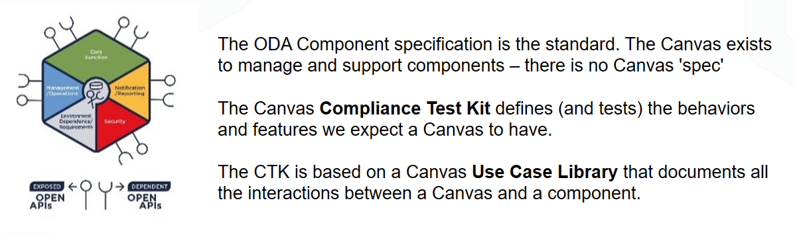

.. Controllers documentation master file, created by
   sphinx-quickstart on Sat Mar 27 16:10:20 2021.
   You can adapt this file completely to your liking, but it should at least
   contain the root `toctree` directive.

Open Digital Architecture - Operators
=================================================

This contains documentation on the Custom Operators that are part of the Open Digital Architecture - Component Accelerator (ODA-CA) project.
The ODA-CA is a reference implementation of the `IG1171 Component Definition <https://www.tmforum.org/resources/exploratory-report/ig1171-oda-component-definition-r19-0-0/>`_

The Custom Operators extend Kubernetes to understand ODA Component resources. They follow the `Kubernetes Operator Pattern <https://kubernetes.io/docs/concepts/extend-kubernetes/operator/>`_ to extend Kubernetes following the intent-driven model. The ODA Component custom resources are available through the Kubernetes API and any Kubernetes tool (e.g. kubectl) that uses this API.

.. toctree::
   :maxdepth: 2
   :caption: Contents:

   README.md
   component-management/modules.rst
   api-management/istio/modules.rst
   api-management/kong/modules.rst
   api-management/apache-apisix/modules.rst
   api-management/apigee/modules.rst
   api-management/azure-apim/modules.rst
   api-management/whalecloud-apim/modules.rst
   identity-config/keycloak/modules.rst
   credentials-management/modules.rst
   dependentApiSimpleOperator/modules.rst
   secretsmanagementOperator-hc/modules.rst

